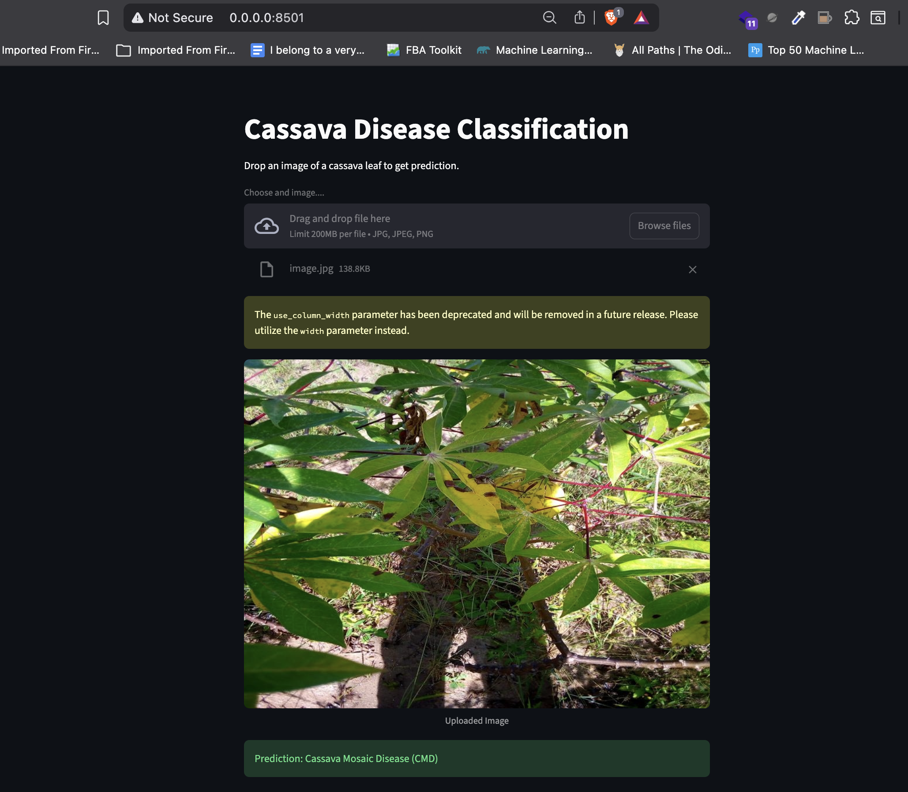
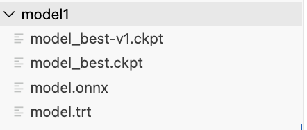
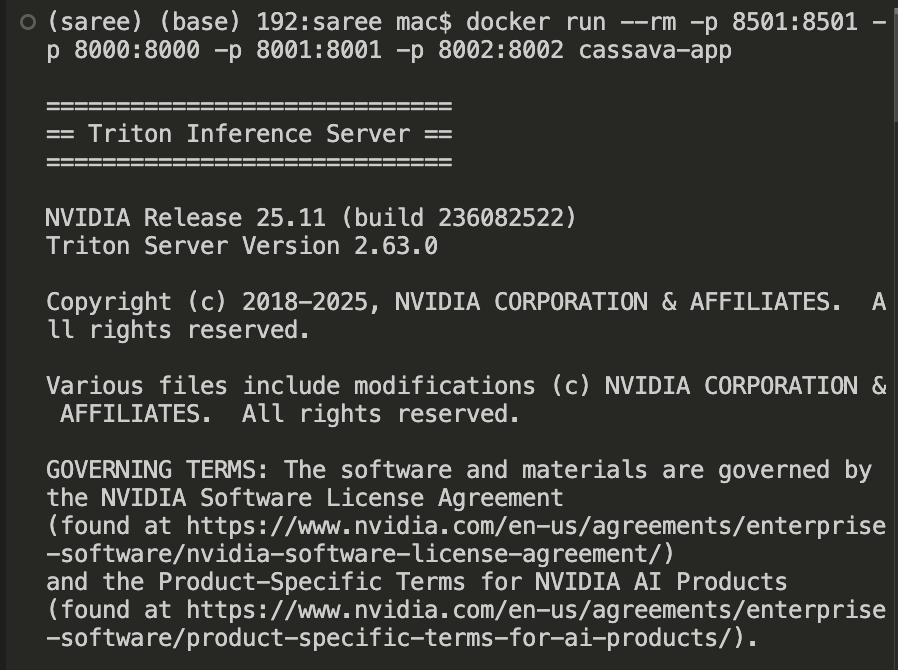
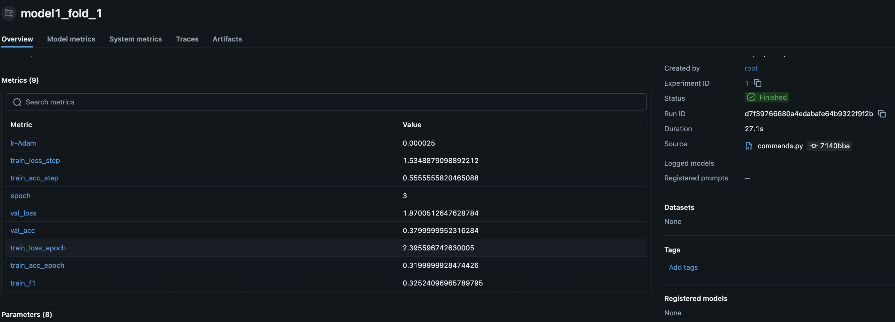
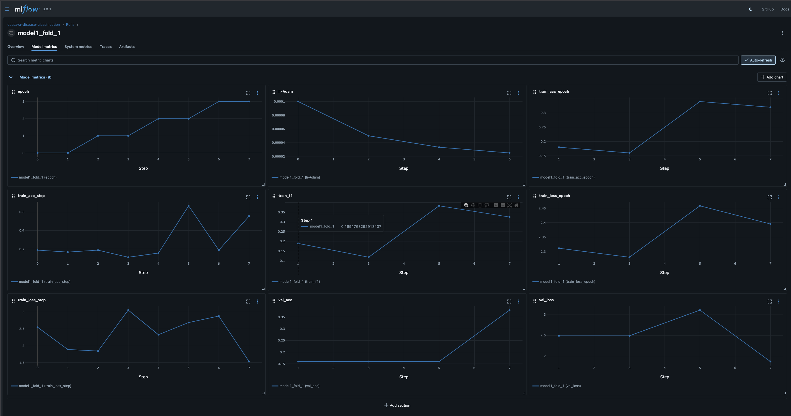
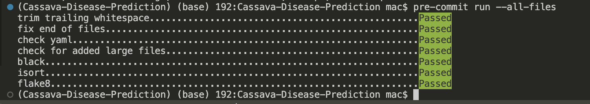

# 🌿 Cassava Leaf Disease Classification

A **high-performance, production-ready deep learning system** for cassava leaf disease classification, inspired by **3rd-place Kaggle competition solutions**.
This project leverages **Vision Transformers (ViT)**, **image patch division**, **attention-based weighting**, and **ensemble learning**, wrapped inside a **full MLOps pipeline** from training to Triton-based deployment.

---

## 🧠 Architecture Overview


---

## 📌 Problem Statement

Cassava is a staple crop for over **800 million people worldwide**, yet it is highly vulnerable to leaf diseases that severely impact yield.
Accurate and early detection is critical for disease management and food security.

This repository provides an **end-to-end solution** for classifying cassava leaf diseases from images using state-of-the-art deep learning techniques.

---

## 🚀 Key Features

- **Ensemble of 3 Vision Transformer models**
  - ViT-384 (global context)
  - ViT-448 ×2 (patch-based fine-grained analysis)
- **Image Division Strategy**
  - 448×448 images split into four 224×224 patches
- **Attention-Based Feature Weighting**
  - Learns importance of spatial regions
- **Multi-Dropout Regularization**
  - Improves robustness and generalization
- **Label Smoothing**
  - Handles noisy labels
- **End-to-End MLOps**
  - DVC, Hydra, PyTorch Lightning, MLflow
- **Production Deployment**
  - ONNX → TensorRT → Triton Inference Server

---

## 🧠 Classes

- Cassava Bacterial Blight (CBB)
- Cassava Brown Streak Disease (CBSD)
- Cassava Green Mottle (CGM)
- Cassava Mosaic Disease (CMD)
- Healthy

---

## 🛠️ Tech Stack

| Component | Tool |
|--------|------|
| Training | PyTorch Lightning |
| Models | Vision Transformers (timm) |
| Config | Hydra |
| Data | DVC |
| Tracking | MLflow |
| Inference | ONNX Runtime / TensorRT |
| Serving | Triton Inference Server |
| Env | uv |

---

## ⚙️ Installation

### Prerequisites
- Python 3.9+
- Git
- CUDA GPU (optional)

```bash
git clone https://github.com/faranbutt/Cassava-Disease-Prediction.git
cd Cassava-Disease-Prediction

uv venv
source .venv/bin/activate

uv pip install -e .
uv run pre-commit install
```

## 🚂 Training Pipeline

Training is orchestrated using **Hydra** and **PyTorch Lightning**, with datasets versioned and managed via **DVC**.

---

### 1️⃣ Download Dataset

```bash
dvc pull
```

This command fetches the following files:
train.csv
train_images/

### 2️⃣ Run Full Pipeline
```bash
MPLBACKEND=Agg python src/cassava_classifier/commands.py run_full=true
```

This command automatically:
Trains 3 ViT models
Runs K-Fold validation
Logs metrics to MLflow
Saves checkpoints
Exports models to ONNX
Converts to TensorRT
Builds Triton ensemble

## ⚙️ Configuration (Hydra)

All parameters are configurable via YAML:

```bash
configs/
├── model/     # ViT variants, image size, attention
├── train/     # epochs, batch size, LR, folds
├── data/      # dataset paths
└── config.yaml
```

✅ No hardcoded values — everything is configurable.

## 🖥️ Streamlit Interface


## 🌐 Hugging Face Deployment

You can interact with the live model via **Hugging Face Spaces**, deployed automatically using **GitHub Actions**:

[Try the Cassava Leaf Disease Detector](https://huggingface.co/spaces/faranbutt789/Cassava_Leaf_Disease_Detection)

> ⚡ *Note:* The deployment is linked to this repository and automatically updates via GitHub Actions whenever changes are pushed to the `main` branch.


## 📦 Production Artifacts

Generated automatically during training:
model_best.ckpt – PyTorch checkpoints
model.onnx – Framework-agnostic inference
model.trt – Optimized TensorRT engine
Triton config.pbtxt

These artifacts are excluded from Git and managed locally or via deployment targets.

## 💾 Saved Models


## 🔮 Inference Options

🧪 Local (PyTorch / ONNX)
```python
python src/cassava_classifier/commands.py \
  predict=true \
  +predict.use_ensemble=true \
  +predict.image_path="data/test.jpg"
```
🚀 Production (Triton Server)
```python
docker run --rm -p 8000:8000 \
  -v $(pwd)/triton:/models \
  nvcr.io/nvidia/tritonserver:25.11-py3 \
  tritonserver --model-repository=/models
```

## 🚀 Triton Model Serving


## Supports:
GPU (TensorRT)
CPU-only (ONNX Runtime backend)

## 📊 Experiment Tracking

### MLflow logs:
Hyperparameters
- Metrics: loss, accuracy, F1
- Per-fold results
- Training curves


### Launch MLflow:
```bash
mlflow ui --backend-store-uri sqlite:///mlflow.db --port 8080
```

### 📊 MLflow Metrics


## 📈 Training Plots


## 🧪 Code Quality
black, isort, flake8
Pre-commit enforced
Clean modular package structure
CLI-based execution (Hydra)



## 📁 Project Structure
```bash
Cassava-Disease-Prediction/
├── configs/
├── deployment/
│   └── triton/
├── images/
├── src/cassava_classifier/
│   ├── data/
│   ├── models/
│   ├── pipelines/
│   └── utils/
├── data.dvc
├── pyproject.toml
└── README.md
```

## 🔗 References

- [Kaggle 3rd-Place Solution](https://www.kaggle.com/competitions/cassava-leaf-disease-classification/writeups/t0m-3rd-place-solution)
- [ONNX Runtime Quantization](https://onnxruntime.ai/docs/performance/model-optimizations/quantization.html)
- [NVIDIA TensorRT Optimization](https://developer.nvidia.com/tensorrt)
- [Triton Inference Server Performance Guide](https://docs.nvidia.com/deeplearning/triton-inference-server/user-guide/docs/user_guide/performance_tuning.html)
