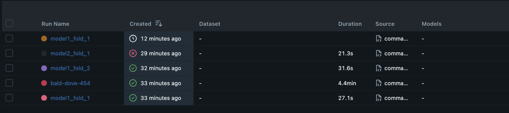

# Cassava Leaf Disease Classification

This repository implements a high-performance solution for the **Cassava Leaf Disease Classification** challenge, inspired by 3rd-place Kaggle competition approaches. The system combines **Vision Transformers with advanced techniques** including image division, attention weighting, multi-dropout, and label smoothing to achieve robust classification of cassava leaf diseases.

## 🌿 Project Overview

Cassava is a vital crop for over 800 million people worldwide, but it is threatened by several devastating diseases. Early and accurate diagnosis is crucial for effective disease management. This project provides:

- **Ensemble of 3 specialized Vision Transformer models**
- **Image division technique** for high-resolution analysis
- **Attention-based feature weighting** across image quadrants
- **Multi-dropout regularization** for improved generalization
- **Label smoothing** to handle noisy labels

The pipeline supports full MLOps workflow: data management, training, validation, inference, and production deployment.

## Architechture


## 🛠️ Technical Setup

### Prerequisites
- Python 3.9+
- Git
- CUDA-enabled GPU (recommended)

### Installation
1. **Clone the repository**
   ```bash
   git clone https://github.com/your-username/cassava-leaf-disease-classifier.git
   cd cassava-leaf-disease-classifier

2. Install dependencies using uv
```
# Install core dependencies
uv add torch torchvision timm pytorch-lightning pandas scikit-learn opencv-python-headless albumentations hydra-core omegaconf

# Install development dependencies
uv add --group dev black isort flake8 pre-commit

# Install the package in editable mode
uv pip install -e .

# Install pre-commit hooks
uv run pre-commit install
```


Commands:
```
git clone https://github.com/faranbutt/Cassava-Disease-Prediction.git
cd Cassava-Disease-Prediction
uv venv
source .venv/bin/activate
uv pip install -e .
uv pip uninstall tensorrt tensorrt-cu12 tensorrt-cu12_bindings tensorrt-cu12_libs
uv pip install tensorrt==10.5.0 --extra-index-url https://pypi.nvidia.com
MPLBACKEND=Agg python src/cassava_classifier/commands.py ++run_full=true
mlflow ui \
  --backend-store-uri sqlite:///mlflow.db \
  --default-artifact-root ./mlartifacts \
  --host 0.0.0.0 \
  --port 8080 \
```


## UI Interface:


## Model Serving


## Metrics


## Metrics Versions
MLFlow plots and logs metrics  for every model per fold 


## Plots


## Models Saved


## Refrences:
https://onnxruntime.ai/docs/performance/model-optimizations/quantization.html
https://medium.com/@bskkim2022/accelerating-ai-inference-with-onnx-and-tensorrt-f9f43bd26854
https://docs.nvidia.com/deeplearning/triton-inference-server/user-guide/docs/user_guide/performance_tuning.html
https://www.kaggle.com/competitions/cassava-leaf-disease-classification/writeups/t0m-3rd-place-solution


